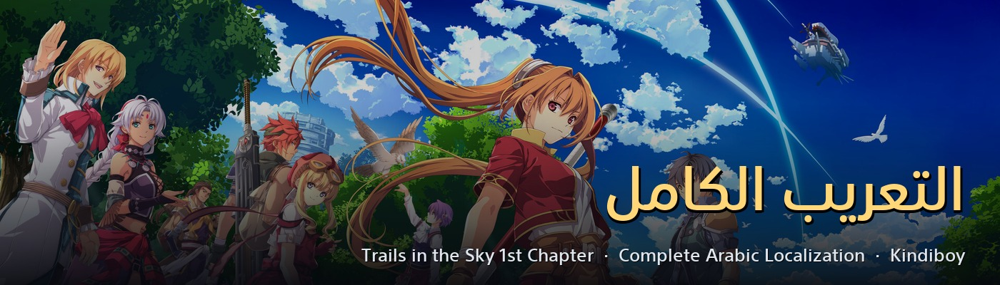
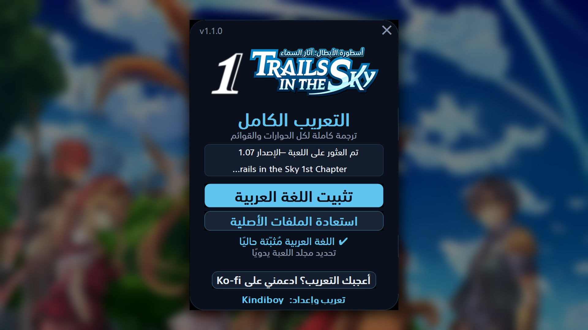

<h1 align="center">Trails in the Sky 1st Chapter — التعريب الكامل</h1>

Complete Arabic localization for <b>The Legend of Heroes: Trails in the Sky 1st Chapter</b> (Steam) · تعريب كامل للعبة

  <a href="https://github.com/faisalkindi/TrailsInTheSky1st-Arabic/releases/latest/download/TrailsInTheSky1st_Arabic_Installer.zip"><b>⬇ تحميل المثبّت / Download installer</b></a>
  &nbsp;·&nbsp;
  <a href="https://github.com/faisalkindi/TrailsInTheSky1st-Arabic/releases">كل الإصدارات / All releases</a>
  &nbsp;·&nbsp;
  <a href="https://ko-fi.com/kindiboy">☕ Ko-fi</a>

---

## العربية

**ماذا يعرّب؟** كل نصّ يظهر على الشاشة، مترجمًا عن النصّ الياباني الأصلي مع مقارنة بالترجمة الإنجليزية:

- **الحوارات كاملة** — القصة الرئيسية والمهام الجانبية وكل حوارات الشخصيات (أكثر من 46,000 فقاعة حوار عبر 154 مشهدًا)
- **القوائم والواجهة** — القائمة الرئيسية، الحالة، الحقيبة، الإعدادات، شاشة الحفظ، لوحة المهام
- **المعارك** — أوامر القتال، المهارات (Crafts) والفنون (Arts) وأوصافها، حالات التأثير
- **الأغراض والتجهيزات** — الأسماء والأوصاف كاملة
- **الإنجازات** وصور تبويبات القائمة
- **صور الواجهة** — 23 صورة معدّلة داخل ملفات اللعبة

**مزايا تقنية**
- عرض عربي صحيح من اليمين إلى اليسار مع محاذاة يمينية
- حروف متصلة بشكل سليم مع دعم التشكيل
- خطاب صحيح نحويًا حسب جنس المتحدَّث إليه عبر مراجعة كاملة للحوارات
- خط عربي مخصّص مدمج داخل ملفات اللعبة — لا حاجة لتثبيت خطوط

**التثبيت**
1. حمّل المثبّت من الرابط أعلاه وشغّله — يكتشف مسار اللعبة تلقائيًا من Steam (أو اختر المجلد يدويًا).
2. اضغط «تثبيت اللغة العربية». يأخذ المثبّت نسخة احتياطية تلقائية من الملفات الأصلية في مجلد `_arabic_mod_backup`.
3. اضبط لغة اللعبة على **English** ثم شغّل اللعبة.

**الإزالة**: شغّل المثبّت نفسه واضغط «إزالة اللغة العربية» — تُستعاد الملفات الأصلية من النسخة الاحتياطية.

## English

**What it covers.** Every string visible in-game, translated from the original Japanese script with the English localization as cross-reference: the full story and NPC dialogue (46,000+ dialogue bubbles across 154 scenes), menus, battle UI, Crafts/Arts/items and their descriptions, status effects, achievements, and 23 in-game UI textures — with proper right-to-left rendering, right-justified text, correctly shaped Arabic glyphs, addressee-gender-correct grammar, and a custom Arabic font embedded in the game files.

**Install**
1. Download the installer above and run it — it auto-detects the Steam install (or pick the folder manually).
2. Click «تثبيت اللغة العربية». Originals are backed up automatically to `_arabic_mod_backup`.
3. Set the game language to **English**, then play.

**Uninstall**: run the same installer and click «استعادة الملفات الأصلية» — originals are restored from the backup.

## Screenshots

## Notes

- v1.1.0 targets the Steam (GungHo) release, game version **1.07** (the installer gates on file layout and refuses a mismatched game version).
- The localization replaces the English language files — set the in-game language to English.
- **Not compatible** with other mods that replace the script/table pacs (e.g. XSeed Restoration Mod, Evo Voice Mod) — install only one.
- After any game update, run the installer again.
- Report typos or clipped text in [Issues](https://github.com/faisalkindi/TrailsInTheSky1st-Arabic/issues).
- Contributors: see [`PIPELINE.md`](PIPELINE.md) for the engine format and build notes.

تعريب وإعداد: <b>Kindiboy</b>

